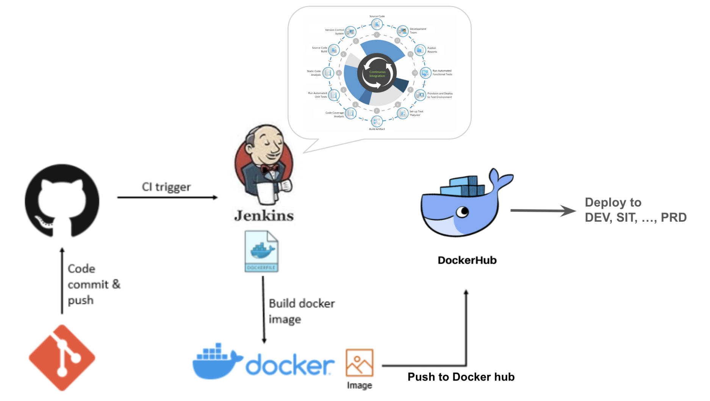

# Docker: Pipeline


> [!IMPORTANT]  
> **Goal:** Create CI/CD pipeline with Jenkins

Steps

1. Running Jenkins
2. Add credential
3. Setup pipeline & create ci
4. Create cd (Add deployment to pipeline)
5. Checking results



---

## 1. Running Jenkins in machine

Start Jenkins

```sh
docker compose up jenkins
```

Go to <http://localhost:5555>

Copy your container id by `docker ps | grep jenkins`

Get your password by replace `<CONTAINER_ID>` with output form `docker ps | grep jenkins`

```sh
docker exec <CONTAINER_ID> cat /var/jenkins_home/secrets/initialAdminPassword
```

Choosing `install suggested plugin` and waiting a moment

Filling username, password, full name and email


Setting Jenkins URL: `http://localhost:5555/` (by default)

Then restart jenkins and run again

```sh
docker compose up -d jenkins
```

---

## 2. Add docker hub credential

Go to <http://localhost:5555/manage/credentials/store/system/domain/_/>

Click `Add credential` button


- Kind: Username with password
- Scope: Global
- Username: `YOUR_DOCKER_HUB_USER`
- Password: `YOUR_DOCKER_HUB_PASSWORD`
- ID: docker_hub
- Description: docker hub


---

## 3. Setup pipeline & create ci

### 3.1 Pull code & create ci

On first page click `+ New Item` menu

Enter pipeline name for example `demo_pipeline`

Click `Pipeline` option and submit

then input code to pipeline script

```sh
pipeline {
    agent any

    stages {
        stage('Checkout code') {
            steps {
              git branch: 'main', url: 'https://github.com/srankmeng/workshop-docker-cicd.git'
            }
        }
        stage('Code analysis') {
            steps {
                echo 'Code analysis'
            }
        }
        stage('Unit test') {
            steps {
                echo 'Unit test'
            }
        }
        stage('Code coverage') {
            steps {
                echo 'Code coverage'
            }
        }
        stage('Build images') {
            steps {
                dir("pipeline") {
                    sh 'docker compose build json_server'
                }
            }
        }
        stage('Setup & Provisioning') {
            steps {
                dir("pipeline") {
                    sh 'docker compose up json_server -d'
                }
            }
        }
        stage('Run api automate test') {
            steps {
                dir("pipeline") {
                    sh 'docker compose build postman'
                    sh 'docker compose up postman --abort-on-container-exit'
                }
            }
        }
    }
    post {
        always {
            dir("pipeline") {
                sh 'docker compose down json_server postman'
            }
        }
    }
}
```

### 3.2 Push iamges to registry after CI success

Add 'Push Docker Image to Docker Hub' stage after `stage('Run api automate test')`

```sh
        stage('Push Docker Image to Docker Hub') {
            steps {
                withCredentials([usernamePassword(credentialsId: 'docker_hub', passwordVariable: 'DOCKER_PASS', usernameVariable: 'DOCKER_USER')]) {
                    dir("pipeline") {
                        sh 'docker login -u $DOCKER_USER -p $DOCKER_PASS'
                        sh '''docker image tag my_json_server:1.0 $DOCKER_USER/my_json_server:$BUILD_NUMBER
                            docker image push $DOCKER_USER/my_json_server:$BUILD_NUMBER'''
                    }
                }        
            }
        } 
```

Checking docker image in docker hub account

---

## 4. Create cd (Add deployment to pipeline)

### 4.1 Add deployment to pipeline

Add 'Deploy application' stage after `stage('Push Docker Image to Docker Hub')`

```sh
        stage('Deploy application') {
            steps {
                withCredentials([usernamePassword(credentialsId: 'docker_hub', passwordVariable: 'DOCKER_PASS', usernameVariable: 'DOCKER_USER')]) {
                    dir("pipeline") {
                        sh 'docker stop my_json_server_dev || true'
                        sh 'docker rm my_json_server_dev || true'
                        sh 'docker run -p 3001:3000 --name my_json_server_dev -d $DOCKER_USER/my_json_server:$BUILD_NUMBER'
                    }
                }
            }
        }
```

Go to `http://localhost:3001`

---

### 4.2 Polling git for trigger pipelines

Go to the pipeline: Configure > Build Triggers > Poll SCM > input `* * * * *`
